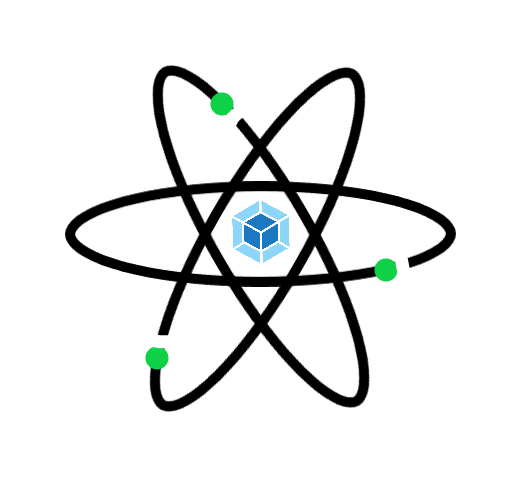

  

Starter code for your next React Saga application

Are you looking for a React codebase which has Redux-Saga and Scss setup from the scratch? Not sure how to setup Webpack and babel? Want to stay away from Create-React-App? Well if you have these mind-boggling question then you come to the right place. Webpack-React-Saga is is one stop solution for 
- Rapidly build POC(Proof of Concepts) around React hooks and Redux-Saga with webpack.
- Boilerplate code for your next big assignment.
- In built configuration for Production and Develop environment.
- Storybooks provided, to build components ahead of time.

You can find the live demo over [here](https://master.d3knmnietsgia5.amplifyapp.com)

## 💻 Technology Stack

- **React**
- **Redux-Saga**
- **ES6+**
- **Sass**
- **Webpack**
- **Jest**
- **Enzyme**
- **Storybook.js**
- **Babel**

## 🚀 Features
- Lean and easy to understand webpack configurations for production and development environment.
- Sass/Scss support. No more plain old CSS 😁.
- Unit test case examples included (More will be added soon).
- NO create-react-app used. You can configure your app as per your need.
- Functional components and hooks 😍.
- Proper implementation of Redux-Saga without polluting actions.
- Boilerplate code is based on a real-world project done for one of my clients.
- Constant maintenance and package updates.
- Optimized bundle size for production.
- Redux devtool integration with trace enabled.
- Storybook.js to showcase your componet ahead of feature development.

## How to use?

### Development server

    $ git clone https://github.com/sprakash57/webpack-react-saga.git
    $ cd webpack-react-saga
    $ npm i 
    $ npm start

    > Open `localhost:3000` in the Browser.

### Production build
    $ npm run build

    > Bundle files can be found in `dist` folder under root directory

### Storybook
    $ npm run storybook

    > Open `localhost:6006` in the Browser.

## 🤝 Want to Contribute? Follow these steps (Important!!):
1. Fork this repo. - Click the fork symbol on rightmost top corner of your window.

2. Visit https://github.com/sprakash57/webpack-react-saga/issues, comment on the issue so that i can assign it to you.

3. Clone the forked repo. - Click the green button saying "Code" with a download button.

4. Do a thorough testing, provide inline comments for complex logic.

5. Write proper and meaningful commit messages. Provide information about any new packages included.

6. Create a Pull Request. - Follow this guide https://www.digitalocean.com/community/tutorials/how-to-create-a-pull-request-on-github to raise a PR.

### Note: If you need detailed info on Pull request
https://www.atlassian.com/git/tutorials/making-a-pull-request.
