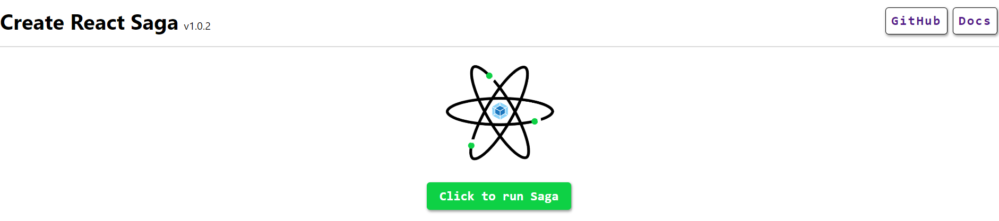

## AWS Amplify

AWS Amplify enables web developers to build and deploy React application quickly. You just need to connect your GitHub branch to AWS Amplify service, and you are good to go. Now whenever you will push anything to your connected branch, AWS Amplify will take care of the deployment process. You will find a running instance of the application over <a href="https://live.d3knmnietsgia5.amplifyapp.com/" target="_blank">here</a>. If you see below image then you are at the right place.



## Build Settings

You don't need to do much on AWS Amplify after you connect your branch. However, you might want to check your amplify.yml file, while you deploy your application for the first time. It should look like this.

```
version: 1
frontend:
  phases:
    preBuild:
      commands:
        - npm ci
    build:
      commands:
        - npm run build
  artifacts:
    # IMPORTANT - Please verify your build output directory
    baseDirectory: dist
    files:
      - '**/*'
  cache:
    paths:
      - node_modules/**/*
```

> More platforms and how tos will be added soon for deployment.
